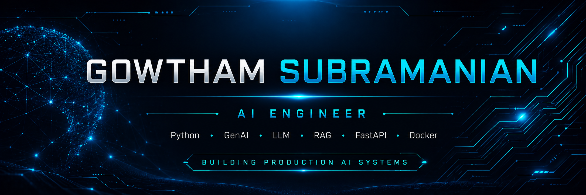

  

<h1 align="center">Hi 👋, I'm Gowtham Subramanian</h1>

<h3 align="center">AI Engineer | GenAI Engineer</h3>

Building Production AI Systems

  

---

# 👨‍💻 About Me

- 🤖 AI Engineer passionate about building production-ready AI systems
- 🧠 Currently learning LLMs, RAG, AI Agents and MLOps
- 🐍 Python-first developer focused on AI backend applications
- 🚀 Building real-world AI portfolio projects
- 🎯 Goal: Principal AI Engineer

---

# 💻 Tech Stack

  

---

# 📈 Contribution Graph

  

---

# 🚀 Featured Projects

| Project | Description | Status |
|---------|-------------|--------|
| 🤖 AI Resume Analyzer | Resume parsing & AI-powered analysis | 🚧 In Progress |
| 🧠 Enterprise RAG | Production-ready Retrieval-Augmented Generation | 🚧 In Progress |
| 🤖 AI Agent Platform | Multi-agent AI automation platform | 🚧 In Progress |
| 📊 MLOps Pipeline | End-to-end ML deployment pipeline | 🚧 In Progress |
| 👁️ Computer Vision | Deep Learning & Computer Vision | 🚧 In Progress |
| 🎬 YouTube AI Studio | AI-powered YouTube Automation Platform | 🚧 In Progress |

---

# 👀 Profile Views

---

# 📫 Connect With Me

---

<i>"Code. Build. Deploy. Impact."</i>

---

⭐ Thanks for visiting my profile! ⭐

> 🚧 This GitHub profile is actively evolving as I build production-ready AI engineering projects.
