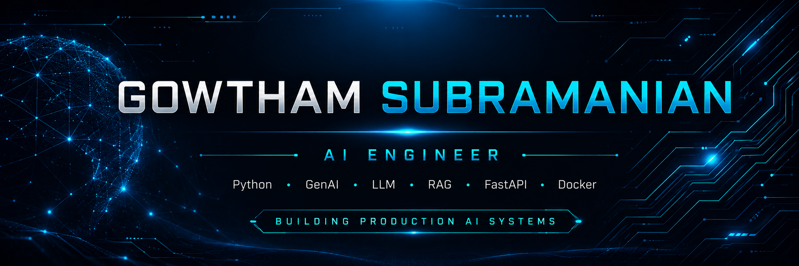

  

<h1 align="center">Hi 👋, I'm Gowtham Subramanian</h1>

<h3 align="center">AI Engineer | GenAI Engineer</h3>

Building Production AI Systems

  

---

# 👨‍💻 About Me

- 🤖 AI Engineer focused on building reliable, production-ready AI systems
- 🐍 Developing strong Python and Software Engineering foundations through hands-on projects
- 🧠 Learning Generative AI, LLMs, RAG, AI Agents, and Machine Learning
- 🏗️ Practicing modular architecture, clean code, automated testing, and engineering best practices
- 🚀 Building practical AI projects with an emphasis on maintainability, scalability, and deployment
- 🎯 Long-term goal: Principal AI Architect

---

# 💻 Tech Stack

  

---

# 📈 Contribution Graph

  

---

## 🐍 Contribution Snake

  

---

## 🏆 GitHub Trophies

  

---

# 🚀 Featured Projects

| Project | Description | Status |
|---------|-------------|--------|
| 🛠️ [NOVA — Intelligent Operations Console](https://github.com/gowtham-subramanian/nova-intelligent-operations-console) | Python software engineering, domain modeling, services, repositories, and automated testing | 🚧 Active Learning Project |
| 🧠 Nexus AI Platform | Modular AI platform engineering and production-ready application foundations | 📋 Roadmap |
| 🏗️ ORION — Modular AI Platform | AI runtime, evaluation, observability, identity, and governance architecture | 📋 Planned |
| 🔎 OSIRIS — Intelligence Dashboard | Intelligence dashboard with data integration and AI-assisted analysis | 📋 Planned |
| 📚 Enterprise RAG Platform | Retrieval-Augmented Generation, embeddings, retrieval quality, and evaluation | 📋 Planned |
| 🤖 AI Agent Platform | Tool use, workflow orchestration, and reliable AI agent execution | 📋 Planned |
| 🛡️ AI Cybersecurity Intelligence Platform | Threat intelligence, evidence correlation, and AI-assisted security analysis | 📋 Future Roadmap |

---

# 👀 Profile Views

>> 🚧 This GitHub profile is evolving alongside my Software Engineering and AI Engineering mentorship, with projects progressing from foundational Python applications toward production-ready AI systems.

---

# 📫 Connect With Me

---

<i>"Code. Build. Deploy. Impact."</i>

---

⭐ Thanks for visiting my profile! ⭐

> 🚧 This GitHub profile is actively evolving as I build production-ready AI engineering projects.
